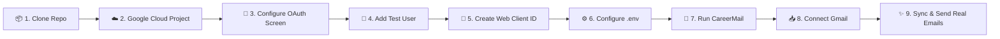

# 📬 CareerMail — Intelligent Email & Job Application Tracker

CareerMail combines a modern, high-performance email experience with an intelligent job application tracking platform. It solves the friction job seekers face with critical career communications scattered across hundreds of recruiter emails by automatically parsing, detecting, organizing, and visualizing job applications in one unified workspace.

Inspired by the design aesthetics of Linear, Notion, and premium fintech dashboards, CareerMail features a pixel-perfect dark theme, interactive Kanban pipeline, area and donut charts, countdown reminders, an integrated Q&A Career Assistant, and a **complete Google OAuth 2.0 Gmail integration**.

---

## 📸 Dashboard Preview

CareerMail features a pixel-perfect dark workspace matching modern SaaS standards:

* **5 Real-Time KPI Metric Cards**: Total Applications, Interviews, Offers, Rejections, Response Rate.
* **Applications Over Time Chart**: Smooth gradient spline chart with hover metrics.
* **Application Status Donut Chart**: Breakdown across Applied, Interview, Assessment, Offer, Rejected, and Withdrawn stages.
* **Upcoming Interviews & Follow-ups Queue**: Real-time countdown badges (`In 2 days`, `Due in 1 day`) with video link launchers.
* **Kanban Application Pipeline**: Drag-and-drop board across 6 stages with instant database persistence.
* **Floating Career Assistant**: An intelligent in-app assistant that queries your real career database.
* **Full-Featured Email Client**: Inbox, Important, Starred, Sent, Drafts with real-time job detection pipeline banners.
* **Google Gmail OAuth 2.0 & Live Sync**: Authorize with Google, scan recent emails, automatically detect job updates, and link them to your application timeline.

---

## 🛠️ Technology Stack

### Frontend
* **Framework**: React 18 with TypeScript
* **Build Tool**: Vite 5
* **Styling**: Tailwind CSS with custom glassmorphism and deep-navy theme
* **Animation & Polish**: Framer Motion, canvas-confetti
* **Icons**: Lucide React
* **Routing**: React Router DOM 6

### Backend
* **Language & Framework**: Java 21, Spring Boot 3.3
* **Security & Auth**: Spring Security with stateless JWT (`jjwt` 0.12) & BCrypt password hashing
* **Persistence**: Spring Data JPA / Hibernate ORM
* **Google Integration**: Google OAuth 2.0 token exchange, auto-refresh, and Gmail REST API Client
* **Parsing Engine**: Rule-Based Email Intelligence Pipeline (10 classification categories + entity extraction)
* **Validation**: Jakarta Bean Validation

### Database & DevOps
* **Primary Database**: PostgreSQL 16
* **Local In-Memory Fallback**: H2 Database (with `local` profile)
* **Containers**: Docker & Docker Compose (Multi-stage builds, Nginx reverse proxy)

---

## 🧪 Test CareerMail with Your Own Gmail

> [!NOTE]
> **Zero-Secrets Policy**: To adhere to industry security standards and Google API Terms of Service, this public repository does **not** include production Google OAuth client secrets. Any developer, evaluator, or recruiter can connect their own personal or test Gmail account in **under 5 minutes** by creating a free Google Cloud OAuth client.

---

### 🗺️ Visual Setup Flow



---

### 📋 Prerequisites

* A personal or workspace **Google / Gmail account**
* [Google Cloud Console](https://console.cloud.google.com/) access (100% free, no billing setup required)
* **Git**, **Docker** (or **Java 21** + **Node.js 18+**)

---

### 🚀 Step-by-Step Guide

#### 1️⃣ Step 1: Clone the Repository

```bash
git clone https://github.com/your-username/CareerMail.git
cd CareerMail
```

---

#### 2️⃣ Step 2: Create a Free Google Cloud Project

1. Open the **[Google Cloud Console](https://console.cloud.google.com/)**.
2. Click the project dropdown in the top navigation bar and click **"New Project"**.
3. Set **Project name** to `CareerMail-Dev` (or any name you prefer) and click **Create**.
4. Ensure your newly created project is selected in the top bar.

---

#### 3️⃣ Step 3: Enable the Gmail API

1. In the Google Cloud Console, navigate to **APIs & Services > Library** (or search for `Gmail API`).
2. Select **Gmail API** and click **Enable**.

---

#### 4️⃣ Step 4: Configure OAuth Consent Screen & Scopes

1. Go to **APIs & Services > OAuth consent screen**.
2. Select **External** user type and click **Create**.
3. Fill in the basic application info:
   * **App name**: `CareerMail`
   * **User support email**: *Select your Gmail address*
   * **Developer contact email**: *Enter your Gmail address*
   * Click **Save and Continue**.
4. In the **Scopes** step, click **"Add or Remove Scopes"** and add the following 4 scopes:

| Scope | Permission Type | Purpose in CareerMail |
|---|---|---|
| `.../auth/gmail.readonly` | Sensitive | Read incoming recruitment emails & parse job status updates |
| `.../auth/gmail.send` | Sensitive | Send real follow-up and inquiry emails directly via Gmail |
| `.../auth/userinfo.email` | Non-sensitive | Retrieve your authenticated Google email address |
| `.../auth/userinfo.profile` | Non-sensitive | Display your Google account name and avatar |

5. Click **Update** and then **Save and Continue**.
6. In the **Test Users** step, click **"+ ADD USERS"**:
   * Enter the exact **Gmail address** you intend to log in and test with.
   * Click **Add** and then **Save and Continue**.

> [!IMPORTANT]
> **Why Add a Test User?**
> While your Google Cloud app is in *"Testing"* publishing status, Google's security sandbox only allows accounts explicitly listed in the **Test Users** list to authorize.

---

#### 5️⃣ Step 5: Create OAuth 2.0 Web Application Credentials

1. Go to **APIs & Services > Credentials**.
2. Click **+ CREATE CREDENTIALS** at the top and select **OAuth client ID**.
3. Configure the credential settings:
   * **Application type**: `Web application`
   * **Name**: `CareerMail Web Client`
4. Add the **Authorized JavaScript origins**:
   * `http://localhost:5173`
   * `http://localhost`
5. Add the **Authorized redirect URIs**:
   * `http://localhost:8080/api/auth/google/callback`
6. Click **Create**.
7. A dialog will pop up displaying your **Client ID** and **Client Secret**. Copy both values.

---

#### 6️⃣ Step 6: Configure Your Local `.env` File

Copy the provided `.env.example` file to `.env`:

```bash
cp .env.example .env
```

Open `.env` in your editor and paste your credentials:

```ini
# ==============================================================================
# Google Cloud Platform & Gmail OAuth 2.0 Configuration
# ==============================================================================
GOOGLE_CLIENT_ID=your-google-client-id.apps.googleusercontent.com
GOOGLE_CLIENT_SECRET=your-google-client-secret
GOOGLE_REDIRECT_URI=http://localhost:8080/api/auth/google/callback

# Frontend Origin
FRONTEND_URL=http://localhost:5173
```

> [!CAUTION]
> **Security Reminder**: Never commit your `.env` file or API secrets to version control. The repository's `.gitignore` automatically excludes `.env` to protect your credentials.

---

#### 7️⃣ Step 7: Start CareerMail

You can start the entire application stack using either Docker or local development mode:

##### Option A: Docker Compose (Recommended)
```bash
docker compose up --build
```

##### Option B: Local Development
```bash
# Terminal 1: Start Backend (Port 8080)
cd backend
mvn spring-boot:run

# Terminal 2: Start Frontend (Port 5173)
cd frontend
npm install
npm run dev
```

---

#### 8️⃣ Step 8: Connect Your Gmail & Test the Pipeline

1. Open your browser and navigate to **[http://localhost:5173](http://localhost:5173)**.
2. Sign in with the default credentials (`arjun.sharma@email.com` / `password123`) or click **"Continue with Google"**.
3. In the sidebar, navigate to **Settings** (`/settings`).
4. In the **Gmail Integration** card, click **"Connect Gmail"**.
5. Google will open the OAuth consent prompt:
   * Select your test Gmail account.
   * If Google displays a *"Google hasn’t verified this app"* warning screen, click **Advanced > Go to CareerMail (unsafe)** (this is standard for personal development projects in Testing mode).
   * Grant permissions for **Read** and **Send** access and click **Continue**.
6. You will be redirected back to CareerMail with a green **CONNECTED** status badge.
7. Click **"Scan Recent Emails"** or trigger **Full 3-Month Auto-Scan**:
   * CareerMail connects to Gmail API `users/me/messages`.
   * Automatically scans your real inbox from the last 90+ days.
   * Extracts real applications, recruiter contacts, interview invitations, and status changes into PostgreSQL.
   * Populates your KPI counters, Kanban pipeline, timeline, and charts!
8. Click **"Compose"** (or use the **Quick Recruiter Follow-up** action on any application card) to test sending a real RFC 822 MIME email directly via Google's `users/me/messages/send` API!

---

### 🛠️ Common Troubleshooting & FAQs

| Symptom / Error | Cause | Quick Solution |
|---|---|---|
| **`Access blocked: CareerMail has not completed the Google verification process`** | Your Gmail address is not listed under Test Users in Google Cloud. | Go to **OAuth consent screen > Test users**, add your Gmail address, and click Save. |
| **`Error 400: redirect_uri_mismatch`** | The redirect URI in `.env` does not match the Google Cloud Console credentials. | Ensure `http://localhost:8080/api/auth/google/callback` is added under **Authorized redirect URIs** in Google Cloud Console. |
| **`403 FORBIDDEN: Request had insufficient authentication scopes`** | The account was authorized before `gmail.send` scope was added. | Go to **Settings**, click **Disconnect**, and then **Connect Gmail** to accept the updated sending permissions. |
| **Backend fails with DB connection error** | PostgreSQL service is not running locally. | Run via `docker compose up` or run backend with `-Dspring-boot.run.profiles=local` for embedded H2. |

---

## 🚀 Quick Start with Docker

Launch the complete stack (PostgreSQL, Spring Boot Backend, and React Frontend) with Docker Compose:

```bash
docker compose up --build
```

Once started:
* **Web App (Frontend)**: [http://localhost](http://localhost) (or [http://localhost:5173](http://localhost:5173))
* **REST API (Backend)**: [http://localhost:8080/api](http://localhost:8080/api)
* **Database (PostgreSQL)**: `localhost:5432` (`careermail` / `careermail123`)

---

## 💻 Local Setup Without Docker

### Prerequisites
* **Java 21** or higher
* **Maven 3.9+**
* **Node.js 18+** & **npm**

### 1. Start the Backend
You can run the backend against the embedded database (zero configuration required):

```bash
cd backend
mvn spring-boot:run -Dspring-boot.run.profiles=local
```
The backend will start at `http://localhost:8080`.

### 2. Start the Frontend
In a new terminal:

```bash
cd frontend
npm install
npm run dev
```
The Vite development server will open at `http://localhost:5173` with automatic API proxying to `http://localhost:8080`.

---

## 🔐 Default Demo Account Credentials

CareerMail automatically seeds realistic data on first launch:

| Field | Value |
|---|---|
| **Email** | `arjun.sharma@email.com` |
| **Password** | `password123` |

> *Tip: On the login page, you can click **"Continue with Google"** or **"One-Click Demo Login"** to sign in instantly!*

---

## 🤖 Automatic Email → Job Tracker Intelligence Pipeline

CareerMail's ingestion engine parses email subjects, headers, and RFC2822 base64 bodies through 10 classification categories:

```text
Incoming Gmail Message / Ingested Email
                 ↓
      RuleBasedEmailAnalyzer
  (10 Classification Categories)
   • APPLICATION_SUBMITTED
   • APPLICATION_RECEIVED
   • RECRUITER_MESSAGE
   • INTERVIEW_INVITATION
   • INTERVIEW_SCHEDULED
   • ASSESSMENT
   • REJECTION
   • OFFER
   • STATUS_UPDATE
   • OTHER_JOB_RELATED
                 ↓
      Entity & Field Extractor
   • Company (Known entities & regex patterns)
   • Job Title & Seniority Level
   • Location & Work Type (Remote / Hybrid / On-site)
   • Deadlines & Assessment Durations
   • Interview Dates & Google Meet / Zoom Links
   • Compensation & Salary Figures
                 ↓
      Smart Deduplication & Grouping
   • Check existing applications by company & title
   • Update application stage (e.g. APPLIED → INTERVIEW → OFFER)
   • Append chronological Timeline Event
   • Auto-create Interview or Follow-up task if needed
                 ↓
      Real-Time Dashboard & Board Refresh
```

---

## 📡 REST API Documentation

### Authentication & Google OAuth (`/api/auth`)
* `POST /api/auth/register` — Register a new account
* `POST /api/auth/login` — Sign in and obtain a JWT bearer token
* `GET /api/auth/me` — Retrieve currently authenticated user profile
* `GET /api/auth/google/url` — Generate Google OAuth 2.0 authorization URL
* `GET /api/auth/google/callback` — Exchange auth code, store refresh tokens, redirect to frontend
* `GET /api/auth/google/config` — View OAuth client configuration status

### Gmail Integration (`/api/gmail`)
* `GET /api/gmail/status` — Get Gmail connection status, email address, sync timestamp
* `POST /api/gmail/sync?maxResults=30` — Scan Gmail messages, extract applications, prevent duplicates
* `POST /api/gmail/disconnect` — Disconnect Gmail account and revoke access

### Job Applications (`/api/applications`)
* `GET /api/applications` — List all tracked applications
* `GET /api/applications/{id}` — Get application details with timeline & contacts
* `POST /api/applications` — Create a job application manually
* `PUT /api/applications/{id}` — Update application details
* `PATCH /api/applications/{id}/status` — Update Kanban pipeline status
* `DELETE /api/applications/{id}` — Remove an application
* `GET /api/applications/search?q={query}` — Search across company, title, recruiter

### Emails (`/api/emails`)
* `GET /api/emails?folder={inbox|important|starred|sent|drafts}` — List folder emails
* `GET /api/emails/{id}` — Read specific email
* `PATCH /api/emails/{id}/read` — Toggle read/unread
* `PATCH /api/emails/{id}/star` — Toggle starred status
* `PATCH /api/emails/{id}/important` — Toggle important bookmark
* `POST /api/emails/compose` — Send outgoing email
* `POST /api/emails/simulate` — Ingest simulated email to trigger auto-pipeline
* `GET /api/emails/counts` — Retrieve folder badge counters

### Interviews (`/api/interviews`)
* `GET /api/interviews` — List upcoming and past interviews
* `POST /api/interviews` — Schedule a new interview
* `PUT /api/interviews/{id}` — Update interview information
* `DELETE /api/interviews/{id}` — Delete interview

### Follow-ups (`/api/followups`)
* `GET /api/followups` — List pending follow-ups with due badges
* `POST /api/followups` — Create a follow-up reminder
* `PUT /api/followups/{id}` — Update follow-up status (e.g. `COMPLETED`)
* `DELETE /api/followups/{id}` — Remove follow-up

### Analytics & AI Assistant
* `GET /api/analytics` — Dynamic KPI counters, trends, and status distributions
* `POST /api/assistant/ask` — Natural-language query interface against live career data

---

## 🧪 Testing

### Backend Unit & Integration Tests
Run the comprehensive Spring Boot test suite:
```bash
cd backend
mvn clean test
```

### Frontend Typecheck & Production Build
Validate TypeScript types and compile the Vite asset bundle:
```bash
cd frontend
npm run build
```

---

## 📄 License
MIT License. Built as an end-to-end full-stack portfolio product.
