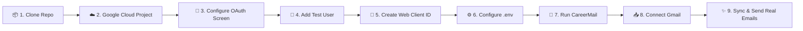

<div align="center">

# 📬 CareerMail
### Next-Gen Intelligent Email & Job Application Tracking Platform

[](https://youtu.be/xVjkWtoF9zU)

<br/>

[](https://youtu.be/xVjkWtoF9zU)
[](https://www.linkedin.com/in/akarshanrasyal/)
[](https://spring.io/projects/spring-boot)
[](https://reactjs.org/)
[](https://www.typescriptlang.org/)
[](https://www.postgresql.org/)
[](https://junit.org/junit5/)
[](https://www.docker.com/)

<p align="center">
  <b>CareerMail bridges high-performance email management with automated job application tracking, live Gmail OAuth synchronization, recruiter intelligence, and context-aware AI career assistance.</b>
</p>

[**📺 Watch Video Demo**](https://youtu.be/xVjkWtoF9zU) • [**✨ Key Features**](#-key-features) • [**🧪 Test with Your Own Gmail**](#-test-careermail-with-your-own-gmail) • [**🏗️ Architecture**](#-system-architecture) • [**🚀 Quickstart**](#-quick-start-with-docker) • [**📡 REST API**](#-rest-api-documentation)

</div>

---

## 🌟 Overview

CareerMail eliminates the chaos job seekers experience when managing dozens of recruitment threads across their inbox. By combining a modern webmail client with an autonomous NLP ingestion pipeline, CareerMail scans incoming recruiter emails, categorizes interview invites, assessments, rejections, and job offers, extracts contact info and deadlines, and keeps your entire career pipeline updated in real time.

Designed with inspiration from **Linear**, **Notion**, and high-end fintech dashboards, CareerMail features a fluid dark theme, responsive Kanban boards, dynamic analytics charts, recruiter contact books, and an integrated **AI Career Assistant** grounded in your live PostgreSQL data.

---

## ✨ Key Features

### 1. 🤖 Context-Aware AI Career Assistant
* **PostgreSQL Data Grounding**: Never hallucinates—answers questions directly from your live application records, interview timelines, recruiter notes, and emails.
* **"✨ What Should I Do Next?" Engine**: Automatically categorizes your live career data into actionable priorities:
  - 🔴 **Urgent**: Interviews within 48h and overdue follow-ups.
  - 🟠 **Needs Attention**: Stale applications waiting >10 days without a reply.
  - 🔵 **Upcoming**: Scheduled calls and deadlines.
  - 🟢 **Positive Progress**: Active offers and advancements.
* **Smart Email Assistant**: Instantly drafts follow-ups, interview thank-you notes, and recruiter replies with 1-click transfer to the Gmail Compose modal (never auto-sends without user confirmation).
* **Interactive Navigation Cards**: Jump straight to related applications or compose actions directly from chat cards.

### 2. 📬 Integrated Email Client with Real RFC 822 Sending
* **Complete Webmail Suite**: Inbox, Starred, Important, Sent, Drafts, and Archive folders.
* **Real Gmail API Sending**: Composes and encodes standard RFC 822 / MIME messages and dispatches them via Google's `users/me/messages/send` API.
* **Interactive Email Modal**: View full HTML emails with embedded styles, sender chips, and one-click opportunity conversion.

### 3. 🎯 Kanban Pipeline & Stage Tracking
* **6-Stage Lifecycle**: `Applied` → `Recruiter Screen` → `Assessment` → `Interview` → `Offer` → `Rejected / Withdrawn`.
* **Drag-and-Drop / Instant Updates**: Move applications between stages with immediate database persistence and automated timeline tracking.
* **Full Application Dossier**: View linked emails, interview rounds, contact details, notes, and activity chronologies.

### 4. 💡 Extracted Opportunities from Gmail
* **Automated Opportunity Lead Scanner**: Identifies unsolicited recruiter outreach, new job openings, and matched opportunities from your email.
* **1-Click Pipeline Conversion**: Converts opportunity emails directly into tracked job applications with prefilled recruiter details, salary, and notes.

### 5. 👤 Recruiter & Contact Intelligence
* **Autonomous Entity Extraction**: Automatically extracts human recruiter names, direct emails, phone numbers, job titles, and LinkedIn profiles.
* **Confidence Scoring**: Flags verified human recruiters vs. automated ATS notification systems (`Greenhouse`, `Workday`, `Lever`, `Ashby`).

### 6. 📊 Real-Time Analytics & Trend Charts
* **Live KPI Counters**: Total Applications, Active Interviews, Formal Offers, Rejection Rates, and Response Rates.
* **Dynamic Time-Series Visualizations**: 3-Month, 14-Day, and 7-Day application velocity trendlines.
* **Status Distribution**: Real-time breakdown of your entire job search funnel.

---

## 🛠️ Technology Stack

| Layer | Technologies |
|---|---|
| **Frontend** | React 18, TypeScript, Vite 5, Tailwind CSS, Lucide React, Framer Motion, Axios |
| **Backend** | Java 21, Spring Boot 3.3.3, Spring Security 6.1 (Stateless JWT), Spring Data JPA |
| **Parsing Engine** | Rule-Based Email Intelligence Pipeline (10 classifications + regex entity extractors) |
| **AI Integration** | Context-Aware Career Assistant Service + Optional Gemini 1.5 Flash Fallback |
| **Database** | PostgreSQL 16 (Primary) / H2 In-Memory (Local Profile) |
| **Google Cloud** | Google OAuth 2.0, Gmail REST API (`gmail.readonly`, `gmail.send`) |
| **DevOps & Containers**| Docker, Docker Compose (Multi-stage builds, Nginx reverse proxy) |

---

## 🧪 Test CareerMail with Your Own Gmail

> [!NOTE]
> **Zero-Secrets Policy**: To adhere to industry security standards and Google API Terms of Service, this public repository does **not** include private Google OAuth client secrets. Any developer, evaluator, or recruiter can connect their personal or test Gmail account in **under 5 minutes** by creating a free Google Cloud OAuth client.

---

### 🗺️ Visual Setup Flow



### 🚀 Step-by-Step Guide

#### 1️⃣ Step 1: Clone the Repository

```bash
git clone https://github.com/akarshanrasyal/CareerMail.git
cd CareerMail
```

---

#### 2️⃣ Step 2: Create a Free Google Cloud Project

1. Open the **[Google Cloud Console](https://console.cloud.google.com/)**.
2. Click the project dropdown in the top navigation bar and select **"New Project"**.
3. Set **Project name** to `CareerMail-Dev` and click **Create**.
4. Select your newly created project.

---

#### 3️⃣ Step 3: Enable the Gmail API

1. Navigate to **APIs & Services > Library** (or search for `Gmail API`).
2. Select **Gmail API** and click **Enable**.

---

#### 4️⃣ Step 4: Configure OAuth Consent Screen & Scopes

1. Go to **APIs & Services > OAuth consent screen**.
2. Select **External** user type and click **Create**.
3. Fill in basic application info:
   * **App name**: `CareerMail`
   * **User support email**: *Select your Gmail address*
   * **Developer contact email**: *Enter your Gmail address*
   * Click **Save and Continue**.
4. In the **Scopes** step, click **"Add or Remove Scopes"** and add:

| Scope | Permission Type | Purpose in CareerMail |
|---|---|---|
| `.../auth/gmail.readonly` | Sensitive | Read incoming recruitment emails & parse job status updates |
| `.../auth/gmail.send` | Sensitive | Send real follow-up and inquiry emails directly via Gmail |
| `.../auth/userinfo.email` | Non-sensitive | Retrieve authenticated Google email address |
| `.../auth/userinfo.profile` | Non-sensitive | Display Google account name and avatar |

5. Click **Update** and then **Save and Continue**.
6. In the **Test Users** step, click **"+ ADD USERS"**:
   * Enter the exact **Gmail address** you will log in with.
   * Click **Add** and then **Save and Continue**.

> [!IMPORTANT]
> **Why Add a Test User?**
> While your Google Cloud app is in *"Testing"* mode, Google's security sandbox only permits authorization for accounts explicitly added to the **Test Users** list.

---

#### 5️⃣ Step 5: Create OAuth 2.0 Web Application Credentials

1. Go to **APIs & Services > Credentials**.
2. Click **+ CREATE CREDENTIALS** and select **OAuth client ID**.
3. Configure the settings:
   * **Application type**: `Web application`
   * **Name**: `CareerMail Web Client`
4. Add **Authorized JavaScript origins**:
   * `http://localhost:5173`
   * `http://localhost`
5. Add **Authorized redirect URIs**:
   * `http://localhost:8080/api/auth/google/callback`
6. Click **Create** and copy your **Client ID** and **Client Secret**.

---

#### 6️⃣ Step 6: Configure Your Local `.env` File

Copy `.env.example` to `.env`:

```bash
cp .env.example .env
```

Open `.env` and fill in your credentials:

```ini
# ==============================================================================
# Google Cloud Platform & Gmail OAuth 2.0 Configuration
# ==============================================================================
GOOGLE_CLIENT_ID=your-google-client-id.apps.googleusercontent.com
GOOGLE_CLIENT_SECRET=your-google-client-secret
GOOGLE_REDIRECT_URI=http://localhost:8080/api/auth/google/callback

# Frontend Origin
FRONTEND_URL=http://localhost:5173
```

---

#### 7️⃣ Step 7: Start CareerMail

##### Option A: Docker Compose (Recommended)
```bash
docker compose up --build
```

##### Option B: Local Development Mode
```bash
# Terminal 1: Start Backend (Port 8080)
cd backend
mvn spring-boot:run

# Terminal 2: Start Frontend (Port 5173)
cd frontend
npm install
npm run dev
```

---

#### 8️⃣ Step 8: Connect Your Gmail & Test the Pipeline

1. Open **[http://localhost:5173](http://localhost:5173)** in your browser.
2. Sign in with the default credentials (`arjun.sharma@email.com` / `password123`) or click **"Continue with Google"**.
3. Navigate to **Settings** (`/settings`) from the sidebar.
4. Click **"Connect Gmail"**.
5. When Google displays the consent screen, select your test Gmail account (click *Advanced > Go to CareerMail (unsafe)* if prompted).
6. Grant **Read** and **Send** permissions.
7. Upon redirect, click **"Scan Recent Emails"**:
   * CareerMail will retrieve and parse your recent Gmail messages across the last 90+ days.
   * Job applications, interview invitations, and status changes are automatically created in PostgreSQL!
8. Click **"Compose"** (or use the AI assistant's draft composer) to send a real email directly through your Gmail account!

---

### 🛠️ Common Troubleshooting & FAQs

| Symptom / Error | Cause | Quick Solution |
|---|---|---|
| **`Access blocked: CareerMail has not completed the Google verification process`** | Gmail address is missing from Test Users in Google Cloud. | Go to **OAuth consent screen > Test users**, add your Gmail address, and click Save. |
| **`Error 400: redirect_uri_mismatch`** | Redirect URI in `.env` doesn't match Google Cloud Console. | Verify `http://localhost:8080/api/auth/google/callback` is added under **Authorized redirect URIs**. |
| **`403 FORBIDDEN: Request had insufficient authentication scopes`** | Account was connected before `gmail.send` was requested. | Go to **Settings**, click **Disconnect**, and re-click **Connect Gmail** to approve sending permissions. |
| **Backend DB connection error** | PostgreSQL container or service is not running. | Run `docker compose up` or use `-Dspring-boot.run.profiles=local` for embedded H2. |

---

## 🚀 Quick Start with Docker

Launch PostgreSQL, Spring Boot Backend, and React Frontend in isolated containers:

```bash
docker compose up --build
```

Once running:
* **Web App (Frontend)**: [http://localhost](http://localhost) (or [http://localhost:5173](http://localhost:5173))
* **REST API (Backend)**: [http://localhost:8080/api](http://localhost:8080/api)
* **Database (PostgreSQL)**: `localhost:5432` (`careermail` / `careermail123`)

---

## 💻 Local Setup Without Docker

### 1. Start the Backend
```bash
cd backend
mvn spring-boot:run -Dspring-boot.run.profiles=local
```
The backend starts at `http://localhost:8080` (uses local in-memory H2 database).

### 2. Start the Frontend
```bash
cd frontend
npm install
npm run dev
```
The Vite development server will start at `http://localhost:5173`.

---

## 🔐 Default Demo Account Credentials

CareerMail seeds a rich dataset on startup:

| Field | Value |
|---|---|
| **Email** | `arjun.sharma@email.com` |
| **Password** | `password123` |

---

## 🏗️ System Architecture

```text
┌────────────────────────────────────────────────────────┐
│               CareerMail Web Application               │
│          (React 18 + TypeScript + Vite + Tailwind)     │
└──────────┬──────────────────────────────────▲──────────┘
           │ REST Calls / Bearer JWT          │ WebSocket / Polling
           ▼                                  │
┌────────────────────────────────────────────────────────┐
│           Spring Boot 3.3 Backend Microservice         │
│  ┌──────────────────────────────────────────────────┐  │
│  │   Security Filter Chain & Stateless JWT Auth     │  │
│  └──────────────────────────────────────────────────┘  │
│  ┌──────────────────────────────────────────────────┐  │
│  │    Rule-Based Email Ingestion & Analysis Engine  │  │
│  └──────────────────────────────────────────────────┘  │
│  ┌──────────────────────────────────────────────────┐  │
│  │   Context-Aware AI Assistant & Priority Engine   │  │
│  └──────────────────────────────────────────────────┘  │
│  ┌──────────────────────────────────────────────────┐  │
│  │    Google OAuth 2.0 & RFC 822 MIME Gmail Client  │  │
│  └──────────────────────────────────────────────────┘  │
└──────────┬──────────────────────────────────┬──────────┘
           │ SQL Queries                      │ REST / OAuth
           ▼                                  ▼
┌──────────────────────┐           ┌──────────────────────┐
│    PostgreSQL 16     │           │   Google Gmail API   │
│  (Applications,      │           │  (users/me/messages, │
│   Interviews,        │           │   users/me/send,     │
│   Emails, Timeline)  │           │   OAuth2 Token API)  │
└──────────────────────┘           └──────────────────────┘
```

---

## 📡 REST API Documentation

### Authentication & Profile (`/api/auth`)
* `POST /api/auth/register` — Register a new user
* `POST /api/auth/login` — Sign in and receive JWT token
* `GET /api/auth/me` — Retrieve current user profile
* `PUT /api/auth/profile` — Update user profile & avatar
* `GET /api/auth/google/url` — Generate Google OAuth authorization URL
* `GET /api/auth/google/callback` — OAuth code exchange callback
* `GET /api/auth/google/config` — Check OAuth client configuration state

### Gmail Synchronization & Sending (`/api/gmail`)
* `GET /api/gmail/status` — Get Gmail connection and scope status
* `POST /api/gmail/sync` — Scan and ingest emails from Gmail inbox
* `POST /api/gmail/reprocess` — Re-evaluate stored emails with NLP engine
* `POST /api/gmail/disconnect` — Disconnect linked Google account

### AI Career Assistant (`/api/assistant`)
* `POST /api/assistant/ask` — Context-aware natural language Q&A, draft generation, and priority engine

### Extracted Opportunities (`/api/opportunities`)
* `GET /api/opportunities` — Get extracted opportunity leads from Gmail
* `POST /api/opportunities/{emailId}/convert` — Convert opportunity email into tracked application
* `POST /api/opportunities/scan` — Perform dedicated opportunity search scan

### Job Applications (`/api/applications`)
* `GET /api/applications` — List all job applications
* `GET /api/applications/{id}` — Get single application with timeline
* `POST /api/applications` — Create job application
* `PUT /api/applications/{id}` — Update job application
* `PATCH /api/applications/{id}/status` — Move application stage
* `DELETE /api/applications/{id}` — Delete application & dissociate emails
* `GET /api/applications/search` — Search applications by keyword

### Emails (`/api/emails`)
* `GET /api/emails` — Filter emails by folder (`INBOX`, `SENT`, `STARRED`, `IMPORTANT`, `DRAFTS`)
* `GET /api/emails/{id}` — Get email by ID
* `POST /api/emails/compose` — Send outgoing email via Gmail API
* `PATCH /api/emails/{id}/read` — Toggle read status
* `PATCH /api/emails/{id}/star` — Toggle starred status
* `PATCH /api/emails/{id}/important` — Toggle important status
* `GET /api/emails/counts` — Get folder badge counts

### Interviews & Follow-ups (`/api/interviews` & `/api/followups`)
* `GET /api/interviews` | `POST /api/interviews` | `PUT /api/interviews/{id}` | `DELETE /api/interviews/{id}`
* `GET /api/followups` | `POST /api/followups` | `PUT /api/followups/{id}` | `DELETE /api/followups/{id}`

### Analytics (`/api/analytics`)
* `GET /api/analytics/dashboard` — Get KPI metrics, response rates, monthly & daily trend charts

---

## 🧪 Testing & Verification

### Backend Tests
```bash
cd backend
mvn clean test
```
* **Result**: `29/29 tests passed (100% SUCCESS)` in `~5.7s`.

### Frontend Typecheck & Build
```bash
cd frontend
npm run build
```
* **Result**: `0 TypeScript/Vite errors`, production assets compiled cleanly.

---

## 👤 Author & Attribution

Created with ❤️ by **[Akarshan Rasyal](https://www.linkedin.com/in/akarshanrasyal/)**

---

## 📄 License
This project is open-source and available under the [MIT License](LICENSE).
